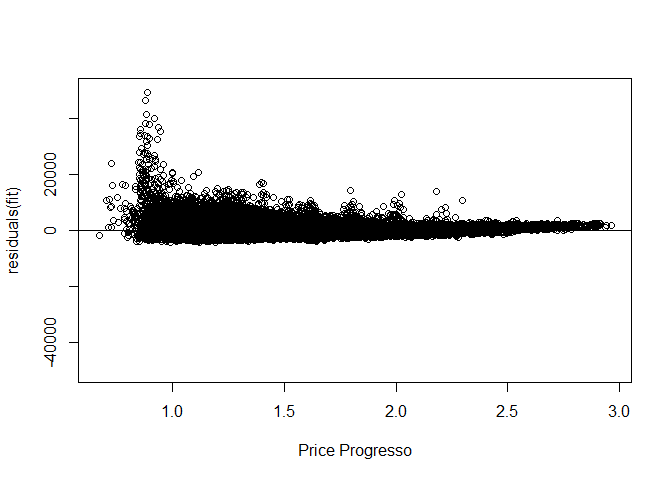
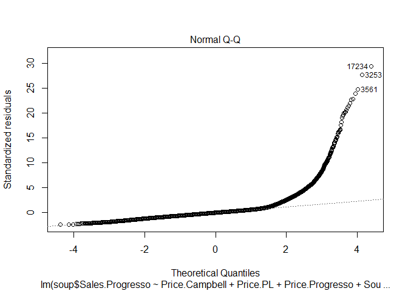

# Progresso Soup Analysis
Steven Nichols  
November 26, 2016  


```r
setwd("C:\\Users\\Steven\\Google Drive\\1. MOT\\1) Fall 2016\\1. BA\\Assignments\\Homework 2")
library(MASS)
library(psych)
soup <- read.csv("soup.csv")
```

##create "season" vector and convert to factor 

```r
soup["Season"] <- NULL
for (i in 1:nrow(soup)) {
  if (soup$Month[i] >= 10 || soup$Month[i] <=2) {
    soup$Season[i] <- 1
  }
  else {
    soup$Season[i] <- 0
  }
}
soup$Region <- factor(soup$Region)
```

##create regional labels and convert to factors 


```r
soup$MidWest<- as.logical(0) 
soup$West<- as.logical(0)  
soup$South<- as.logical(0)  
soup$East<- as.logical(0)  

for (i in 1:nrow(soup)) {
  if (soup$Region[i] == "MidWest") {
    soup$MidWest[i] <- as.logical(1)
    
  }
  else if (soup$Region[i] =="West") {
    soup$West[i] <- as.logical(1)

  }
  else if (soup$Region[i] =="East") {
  
    soup$East[i] <- as.logical(1)
  }
  else {
    soup$South[i] <- as.logical(1)
  }
}
```

##calculate seasonal market shares 


```r
shareWinter <- (sum(soup$Sales.Progresso[soup$Season == 1]) / sum(soup$Category_Sales[soup$Season == 1])) * 100
shareNonWinter <- (sum(soup$Sales.Progresso[soup$Season == 0]) / sum(soup$Category_Sales[soup$Season == 0])) * 100
shareNonWinter
```

```
## [1] 19.92817
```

```r
shareWinter
```

```
## [1] 28.46215
```

##create linear model including all relevant variables and use Stepwise selection to identify ideal combination for fit 


```r
fit <- lm(soup$Sales.Progresso~Price.Campbell+Price.PL+Price.Progresso+South+West+East+MidWest+High_Income+Low_Income+Season, data=soup)

summary(fit)
```

```
## 
## Call:
## lm(formula = soup$Sales.Progresso ~ Price.Campbell + Price.PL + 
##     Price.Progresso + South + West + East + MidWest + High_Income + 
##     Low_Income + Season, data = soup)
## 
## Residuals:
##    Min     1Q Median     3Q    Max 
##  -4256   -839   -173    470  49104 
## 
## Coefficients: (1 not defined because of singularities)
##                 Estimate Std. Error  t value Pr(>|t|)    
## (Intercept)      3086.50      48.94   63.070  < 2e-16 ***
## Price.Campbell    915.70      30.49   30.033  < 2e-16 ***
## Price.PL          613.87      32.10   19.122  < 2e-16 ***
## Price.Progresso -2457.29      19.24 -127.685  < 2e-16 ***
## SouthTRUE        -676.93      16.27  -41.617  < 2e-16 ***
## WestTRUE          -49.64      17.95   -2.766  0.00568 ** 
## EastTRUE         1181.18      18.26   64.698  < 2e-16 ***
## MidWestTRUE           NA         NA       NA       NA    
## High_Income       360.05      14.90   24.165  < 2e-16 ***
## Low_Income       -291.40      14.74  -19.763  < 2e-16 ***
## Season            836.22      12.46   67.103  < 2e-16 ***
## ---
## Signif. codes:  0 '***' 0.001 '**' 0.01 '*' 0.05 '.' 0.1 ' ' 1
## 
## Residual standard error: 1674 on 88399 degrees of freedom
## Multiple R-squared:  0.3945,	Adjusted R-squared:  0.3945 
## F-statistic:  6400 on 9 and 88399 DF,  p-value: < 2.2e-16
```

```r
step <- stepAIC(fit, direction="both")
```

```
## Start:  AIC=1312525
## soup$Sales.Progresso ~ Price.Campbell + Price.PL + Price.Progresso + 
##     South + West + East + MidWest + High_Income + Low_Income + 
##     Season
## 
## 
## Step:  AIC=1312525
## soup$Sales.Progresso ~ Price.Campbell + Price.PL + Price.Progresso + 
##     South + West + East + High_Income + Low_Income + Season
## 
##                   Df  Sum of Sq        RSS     AIC
## <none>                          2.4772e+11 1312525
## - West             1 2.1438e+07 2.4774e+11 1312531
## - Price.PL         1 1.0246e+09 2.4874e+11 1312888
## - Low_Income       1 1.0946e+09 2.4881e+11 1312913
## - High_Income      1 1.6364e+09 2.4936e+11 1313105
## - Price.Campbell   1 2.5276e+09 2.5025e+11 1313421
## - South            1 4.8535e+09 2.5257e+11 1314239
## - East             1 1.1730e+10 2.5945e+11 1316613
## - Season           1 1.2618e+10 2.6034e+11 1316916
## - Price.Progresso  1 4.5687e+10 2.9341e+11 1327487
```

```r
step$anova
```

```
## Stepwise Model Path 
## Analysis of Deviance Table
## 
## Initial Model:
## soup$Sales.Progresso ~ Price.Campbell + Price.PL + Price.Progresso + 
##     South + West + East + MidWest + High_Income + Low_Income + 
##     Season
## 
## Final Model:
## soup$Sales.Progresso ~ Price.Campbell + Price.PL + Price.Progresso + 
##     South + West + East + High_Income + Low_Income + Season
## 
## 
##        Step Df Deviance Resid. Df  Resid. Dev     AIC
## 1                           88399 2.47719e+11 1312525
## 2 - MidWest  0        0     88399 2.47719e+11 1312525
```

```r
summary(step)
```

```
## 
## Call:
## lm(formula = soup$Sales.Progresso ~ Price.Campbell + Price.PL + 
##     Price.Progresso + South + West + East + High_Income + Low_Income + 
##     Season, data = soup)
## 
## Residuals:
##    Min     1Q Median     3Q    Max 
##  -4256   -839   -173    470  49104 
## 
## Coefficients:
##                 Estimate Std. Error  t value Pr(>|t|)    
## (Intercept)      3086.50      48.94   63.070  < 2e-16 ***
## Price.Campbell    915.70      30.49   30.033  < 2e-16 ***
## Price.PL          613.87      32.10   19.122  < 2e-16 ***
## Price.Progresso -2457.29      19.24 -127.685  < 2e-16 ***
## SouthTRUE        -676.93      16.27  -41.617  < 2e-16 ***
## WestTRUE          -49.64      17.95   -2.766  0.00568 ** 
## EastTRUE         1181.18      18.26   64.698  < 2e-16 ***
## High_Income       360.05      14.90   24.165  < 2e-16 ***
## Low_Income       -291.40      14.74  -19.763  < 2e-16 ***
## Season            836.22      12.46   67.103  < 2e-16 ***
## ---
## Signif. codes:  0 '***' 0.001 '**' 0.01 '*' 0.05 '.' 0.1 ' ' 1
## 
## Residual standard error: 1674 on 88399 degrees of freedom
## Multiple R-squared:  0.3945,	Adjusted R-squared:  0.3945 
## F-statistic:  6400 on 9 and 88399 DF,  p-value: < 2.2e-16
```


##perform similar analysis on just Eastern region 


```r
soupEast <- subset(soup, Region=="East")
fitEast <- lm(soupEast$Sales.Progresso~Price.Campbell+Price.PL+Price.Progresso+South+West+East+MidWest+High_Income+Low_Income+Season, data=soupEast)
fitEast
```

```
## 
## Call:
## lm(formula = soupEast$Sales.Progresso ~ Price.Campbell + Price.PL + 
##     Price.Progresso + South + West + East + MidWest + High_Income + 
##     Low_Income + Season, data = soupEast)
## 
## Coefficients:
##     (Intercept)   Price.Campbell         Price.PL  Price.Progresso  
##          6276.5           1485.2            736.7          -4661.9  
##       SouthTRUE         WestTRUE         EastTRUE      MidWestTRUE  
##              NA               NA               NA               NA  
##     High_Income       Low_Income           Season  
##           480.8           -602.9           1679.0
```

```r
summary(fitEast)
```

```
## 
## Call:
## lm(formula = soupEast$Sales.Progresso ~ Price.Campbell + Price.PL + 
##     Price.Progresso + South + West + East + MidWest + High_Income + 
##     Low_Income + Season, data = soupEast)
## 
## Residuals:
##    Min     1Q Median     3Q    Max 
##  -6201  -1390   -323    812  47309 
## 
## Coefficients: (4 not defined because of singularities)
##                 Estimate Std. Error t value Pr(>|t|)    
## (Intercept)      6276.55     147.15  42.654   <2e-16 ***
## Price.Campbell   1485.21     107.41  13.828   <2e-16 ***
## Price.PL          736.69      88.34   8.339   <2e-16 ***
## Price.Progresso -4661.93      72.20 -64.572   <2e-16 ***
## SouthTRUE             NA         NA      NA       NA    
## WestTRUE              NA         NA      NA       NA    
## EastTRUE              NA         NA      NA       NA    
## MidWestTRUE           NA         NA      NA       NA    
## High_Income       480.78      47.10  10.207   <2e-16 ***
## Low_Income       -602.89      51.49 -11.709   <2e-16 ***
## Season           1679.03      44.77  37.507   <2e-16 ***
## ---
## Signif. codes:  0 '***' 0.001 '**' 0.01 '*' 0.05 '.' 0.1 ' ' 1
## 
## Residual standard error: 2707 on 19472 degrees of freedom
## Multiple R-squared:  0.3533,	Adjusted R-squared:  0.3531 
## F-statistic:  1773 on 6 and 19472 DF,  p-value: < 2.2e-16
```

```r
step <- stepAIC(fitEast, direction="both")
```

```
## Start:  AIC=307917.4
## soupEast$Sales.Progresso ~ Price.Campbell + Price.PL + Price.Progresso + 
##     South + West + East + MidWest + High_Income + Low_Income + 
##     Season
## 
## 
## Step:  AIC=307917.4
## soupEast$Sales.Progresso ~ Price.Campbell + Price.PL + Price.Progresso + 
##     South + West + East + High_Income + Low_Income + Season
## 
## 
## Step:  AIC=307917.4
## soupEast$Sales.Progresso ~ Price.Campbell + Price.PL + Price.Progresso + 
##     South + West + High_Income + Low_Income + Season
## 
## 
## Step:  AIC=307917.4
## soupEast$Sales.Progresso ~ Price.Campbell + Price.PL + Price.Progresso + 
##     South + High_Income + Low_Income + Season
## 
## 
## Step:  AIC=307917.4
## soupEast$Sales.Progresso ~ Price.Campbell + Price.PL + Price.Progresso + 
##     High_Income + Low_Income + Season
## 
##                   Df  Sum of Sq        RSS    AIC
## <none>                          1.4270e+11 307917
## - Price.PL         1 5.0960e+08 1.4321e+11 307985
## - High_Income      1 7.6345e+08 1.4347e+11 308019
## - Low_Income       1 1.0047e+09 1.4371e+11 308052
## - Price.Campbell   1 1.4013e+09 1.4410e+11 308106
## - Season           1 1.0310e+10 1.5301e+11 309274
## - Price.Progresso  1 3.0557e+10 1.7326e+11 311695
```

```r
step$anova
```

```
## Stepwise Model Path 
## Analysis of Deviance Table
## 
## Initial Model:
## soupEast$Sales.Progresso ~ Price.Campbell + Price.PL + Price.Progresso + 
##     South + West + East + MidWest + High_Income + Low_Income + 
##     Season
## 
## Final Model:
## soupEast$Sales.Progresso ~ Price.Campbell + Price.PL + Price.Progresso + 
##     High_Income + Low_Income + Season
## 
## 
##        Step Df Deviance Resid. Df   Resid. Dev      AIC
## 1                           19472 142703508653 307917.4
## 2 - MidWest  0        0     19472 142703508653 307917.4
## 3    - East  0        0     19472 142703508653 307917.4
## 4    - West  0        0     19472 142703508653 307917.4
## 5   - South  0        0     19472 142703508653 307917.4
```

```r
summary(step)
```

```
## 
## Call:
## lm(formula = soupEast$Sales.Progresso ~ Price.Campbell + Price.PL + 
##     Price.Progresso + High_Income + Low_Income + Season, data = soupEast)
## 
## Residuals:
##    Min     1Q Median     3Q    Max 
##  -6201  -1390   -323    812  47309 
## 
## Coefficients:
##                 Estimate Std. Error t value Pr(>|t|)    
## (Intercept)      6276.55     147.15  42.654   <2e-16 ***
## Price.Campbell   1485.21     107.41  13.828   <2e-16 ***
## Price.PL          736.69      88.34   8.339   <2e-16 ***
## Price.Progresso -4661.93      72.20 -64.572   <2e-16 ***
## High_Income       480.78      47.10  10.207   <2e-16 ***
## Low_Income       -602.89      51.49 -11.709   <2e-16 ***
## Season           1679.03      44.77  37.507   <2e-16 ***
## ---
## Signif. codes:  0 '***' 0.001 '**' 0.01 '*' 0.05 '.' 0.1 ' ' 1
## 
## Residual standard error: 2707 on 19472 degrees of freedom
## Multiple R-squared:  0.3533,	Adjusted R-squared:  0.3531 
## F-statistic:  1773 on 6 and 19472 DF,  p-value: < 2.2e-16
```


##create variable for residuals of model 


```r
fitRes <- resid(fit)
```


##plot residuals

<!-- --><!-- --><!-- --><!-- --><!-- --><!-- --><!-- -->

